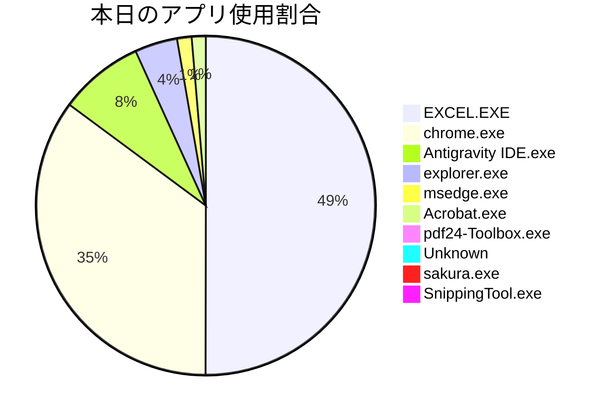

エグゼクティブ様

本日も貴重な業務時間をいただきありがとうございます。ログを分析し、主要な業務と改善提案をまとめました。

---

## 📊 業務サマリーと分析

本日午前中の業務は、IT機器の調達に関する稟議書作成とその付随作業に集約されました。特に、社長および社員用のPC購入およびメモリ増設に関する稟議書の作成に多くの時間を費やし、それに伴う情報整理や関連文書のPDF結合作業が主要な活動でした。AIアシスタントの活用など効率化への意識は高いものの、Excelでの繰り返し編集作業やPDFの結合処理においては、さらなる自動化による効率向上の余地が見られます。

## ⏱ アプリ別の使用時間（グラフィカルデータ）


```text
【アプリ別 稼働時間ランキング】
EXCEL.EXE       | ██████████████                 |  49.4% (49分17秒)
chrome.exe      | ██████████                     |  34.7% (34分36秒)
Antigravity IDE | ██                             |   8.0% (7分57秒)
explorer.exe    | █                              |   4.0% (4分0秒)
msedge.exe      |                                |   1.4% (1分22秒)
Acrobat.exe     |                                |   1.3% (1分19秒)
pdf24-Toolbox.e |                                |   0.6% (33秒)
Unknown         |                                |   0.3% (17秒)
sakura.exe      |                                |   0.2% (14秒)
SnippingTool.ex |                                |   0.2% (9秒)
```

## 💡 自動化・業務改善の提案（DXターゲット）

本日のログからは、以下の手作業がボトルネックとなっている可能性があり、自動化・効率化の対象として優先度が高いと判断できます。

1.  **IT機器購入稟議書作成プロセスの効率化:**
    *   **課題:** Excelでの稟議書作成において、繰り返し内容の編集、書式設定調整、および関連情報のスクリーンショット取得に時間を要しています。特に、仕様や金額の調整に伴う細かな修正作業は非効率です。
    *   **提案:**
        *   **稟議書テンプレートのスマート化:** ExcelマクロやPower Automate Desktopを利用し、定型情報の自動入力、見積書データからの必要項目（モデル名、価格、数量など）の自動転記機能を実装。
        *   **承認フローとの連携:** 最終承認前のドラフトレビューや添付資料の収集・整理を、SharePointなどの文書管理システムやワークフローツールと連携させることで、手動でのファイル添付や確認作業を削減。

2.  **定型的なPDF結合作業の自動化:**
    *   **課題:** 複数のPDFファイルを「PDF24 Toolbox」などのオンラインツールで手動で結合し、その結果の保存や確認にまとまった時間を費やしています。稟議書には複数の添付資料（見積書、仕様書など）が必要となるため、この作業は繰り返し発生する可能性が高いです。
    *   **提案:**
        *   **RPAによる結合プロセスの自動化:** 特定のフォルダに格納されたPDFファイルを、決められた命名規則に基づき自動で結合し、指定のフォルダに保存するRPA（Robotic Process Automation）を導入。これにより、Webツールへのアクセス、ファイルのアップロード、結合、ダウンロードといった一連の操作を自動化します。
        *   **統合された文書管理システム:** 将来的には、稟議書管理システム内で関連文書を自動で紐付け、必要に応じて一括PDF出力できる機能を検討することで、PDF結合の手間そのものを削減できます。

これらの改善により、定型作業から解放され、より戦略的な業務に集中できる時間が増加すると期待されます。

## 📝 主要業務ダイジェスト

### 09:21 〜 09:31：IT業務進捗確認と情報収集

この時間帯は、IT機器の管理状況、アプリ開発の進捗、および業務改善タスクの確認に費やされました。髙山雄輔氏とのチャットやメールを通じて、ラップトップPCやモニターの見積もり、IT機器の調達・トラブル対応に関する情報、社内システムの課題進捗など、多岐にわたるIT関連業務の状況を把握しました。

### 09:31 〜 10:49：IT機器購入稟議書の作成と関連情報整理

主にExcelを使用し、社長および社員向けの新品PC2台と増設メモリの購入に関する稟議書を作成・編集しました。稟議書の内容確認や書式調整に多くの時間を費やし、必要に応じてGoogle GeminiなどのAIアシスタントを活用して情報収集も行われました。また、稟議書に添付する資料として、関連情報のスクリーンショットを適宜取得していました。

### 10:49 〜 11:23：IT機器購入関連PDF文書の結合と最終確認

作成した稟議書や関連する見積書などのPDFファイルを、「PDF24 Toolbox」ウェブサービスを用いて結合する作業に集中的に取り組みました。「役員用PC刷新および故障代替端末調達の件」という最終的な結合ファイルを生成し、その内容の確認、保存、および次の工程への準備を進めていました。この作業には、ファイルの選択、結合ツールの操作、結果のレビューに相応の時間を要しました。