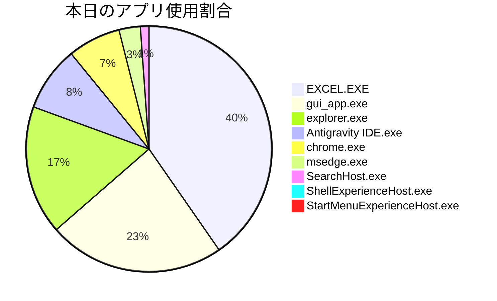

エグゼクティブ向け業務コンサルタント兼RPAエンジニアとして、本日の作業ログを分析し、業務の効率化とDX推進に向けた提案を行います。

## 📊 業務サマリーと分析
本日は、DX推進アシスタント（AIロガー）の活用と設定、およびExcel業務のPythonによる自動化検討に多くの時間を費やされました。特に、ExcelにおけるVLOOKUP関数の手入力やオートフィル、さらにはPDF見積書のExcelへの手動データ集約といった、反復性の高い手作業が散見されました。これらの手作業は自動化による効率化の大きなターゲットであり、今後のDX推進において優先的に取り組むべきボトルネックであると判断します。

## ⏱ アプリ別の使用時間（グラフィカルデータ）


```text
【アプリ別 稼働時間ランキング】
EXCEL.EXE       | ███████████                    |  39.8% (5分59秒)
gui_app.exe     | ██████                         |  22.9% (3分27秒)
explorer.exe    | █████                          |  16.7% (2分31秒)
Antigravity IDE | ██                             |   8.4% (1分16秒)
chrome.exe      | ██                             |   6.9% (1分2秒)
msedge.exe      |                                |   2.8% (25秒)
SearchHost.exe  |                                |   1.1% (10秒)
ShellExperience |                                |   1.0% (9秒)
StartMenuExperi |                                |   0.4% (4秒)
```

## 💡 転記作業の抽出と自動化の提案（DXターゲット）

本日のシステム詳細ログから以下の手作業ボトルネックを特定し、自動化の解決策（DXターゲット）を提案します。

### 1. Excelへの複数回にわたるデータ転記・編集作業
*   **発生時間:** 13:46:52 - 13:48:45 (約2分間)
*   **内容:**
    *   Excelファイル「Book1」の「Sheet1」に対して、頻繁なセルの編集とデータ転記が行われました。
    *   特に注目すべきは、**13:47:00から13:47:13にかけて3回連続で、それぞれ25行1列のデータが貼り付け・編集された**点です。これにより合計75行のデータが手動で処理されています。
    *   その後、13:48:21から13:48:45にかけても、7行1列のデータ転記が3回、2行1列のデータ転記が1回発生しており、合計23行のデータがさらに処理されています。
    *   この間、1行1列の単一セル編集も多数回記録されており、**全体で80行以上のデータが1列にわたり手動で転記・編集**されたと推測されます。
*   **AI画像解析ログとの関連:** 13:46:52-13:48:51にかけて「Excelの作業をPythonで効率化するため、ログ記録ツールの設定と検討中」「業務改善やPython化を検討している」との記述があり、このデータ入力が自動化のテストデータである可能性もありますが、実務であれば大きなボトルネックです。
*   **解決策（DXターゲット）:**
    *   **Pythonによるデータ自動転記:** 転記元が明確であれば、Pythonの`pandas`ライブラリを使用してデータ整形を行い、`openpyxl`や`xlsxwriter`ライブラリでExcelファイルに直接書き込むスクリプトを開発します。これにより、外部システム（Webサイト、DB、CSVファイルなど）からのデータ取得からExcelへの転記までの一連の作業を完全に自動化できます。

### 2. ExcelでのVLOOKUP関数・計算式の手入力とオートフィル
*   **発生時間:** 15:05:49 - 15:07:25 (約1分30秒)
*   **内容:**
    *   「VLOOKUPテスト用.xlsx」ファイルを開き、商品コード、商品名、単価のデータを確認した後、VLOOKUP関数と積算式を手作業で入力し、オートフィル機能を使ってデータ処理を行っていました。
    *   AI画像解析ログでは「【非効率疑い】AI指示に従いExcelのVLOOKUP関数を手作業で入力中」と明確に非効率であると指摘されています。
*   **解決策（DXターゲット）:**
    *   **VBAマクロによる自動化:** Excelファイル内で頻繁に行うVLOOKUPや計算式の入力をVBAマクロとして記録・開発し、ボタン一つで実行できるようにします。これにより、手動での関数入力やオートフィル作業を排除できます。
    *   **Pythonによるデータ処理:** VLOOKUP相当の処理は、Pythonの`pandas`ライブラリの`merge`関数などを使ってデータフレーム上で結合・計算処理を行うことで、より高速かつ柔軟に実現できます。結果は新しいExcelファイルとして出力することも可能です。

### 3. PDF見積書のExcel化と月額合計の集計作業
*   **発生時間:** 20:36:39 - 20:37:22 (約40秒)
*   **内容:**
    *   Google Geminiを利用し、PDF形式の見積書データから必要な情報をExcelシートに手動で集約し、新規・機種変更の月額合計（税抜・税込）を算出する作業を行っていました。
    *   これはPDFからの情報抽出とExcelへの入力、そして計算処理という複数の手作業が複合した業務です。
*   **解決策（DXターゲット）:**
    *   **PythonによるPDFデータ抽出とExcel自動生成:** Pythonの`PyPDF2`や`pdfminer.six`などのライブラリ、または表データ抽出に特化した`Camelot`や`tabula-py`といったライブラリを使用して、PDF内のテキストや表データを自動的に抽出します。抽出したデータは`pandas`で整形・集計し、最終的なExcelレポートを自動生成することで、手動でのデータ入力と計算を一切なくすことができます。
    *   **AI-OCRとRPAの連携:** より複雑なPDFや画像形式の見積書の場合、AI-OCRサービスと連携させ、非定型なデータもテキスト化し、RPAツール（例: UiPath, Power Automate Desktop）でExcelへの自動入力や集計を行うことも検討できます。

これらのDXターゲットは、繰り返し発生する手作業を自動化し、作業時間の大幅な削減と入力ミスの低減に直結します。

## 📝 主要業務ダイジェスト

### 13時台：DX推進アシスタントの活用とExcel自動化の検討
*   **13:43 - 13:46:** DX推進アシスタント（AIロガー）を起動し、Excel業務のPython自動化のためのログ活用についてAIと協議。
*   **13:46 - 13:49:** DXアシスタントの設定と、Excel作業の効率化、Python自動化について検討。この間、**Excel（Book1, Sheet1）に対し、13:47:00から13:47:13にかけて25行1列のデータを3回連続で貼り付けるなど、合計で80行以上にわたるデータの手動編集・転記**を行っていました。これは、自動化対象の業務データ入力、あるいは自動化スクリプトのためのテストデータ入力である可能性があります。

### 15時台：Excel VLOOKUPの手作業とPythonスクリプト開発
*   **15:05 - 15:05:** Excel VLOOKUPなどの手作業をPythonで自動化するツールの開発とテストを検討。
*   **15:05 - 15:07:** 「VLOOKUPテスト用.xlsx」ファイルを開き、**VLOOKUP関数と積算式を手入力し、オートフィルでデータ処理**を実施。「AI指示に従いExcelのVLOOKUP関数を手作業で入力中」との記録があり、手動での関数入力が頻繁に行われていることが示唆されます。同時に、VLOOKUP手入力作業を自動化するPythonスクリプトの開発もAntigravity IDEで行っていました。

### 16時台：開発プロジェクトの管理と日報確認
*   **16:09 - 16:11:** DX推進アシスタント（AIロガー）で作業ログの記録停止を行い、日報出力の準備、保存先フォルダの確認を実施。
*   **16:11 - 16:13:** 自身の開発プロジェクトのbinフォルダやアプリケーション更新テスト用フォルダのファイル管理、DXテスト用大容量Excelファイルの検索、AIロガーが記録した過去の作業日報の確認を行っていました。
*   **16:13 - 16:14:** Antigravity IDEでWindowsUpdate関連アプリの開発作業を行い、付箋でタスク管理。Microsoft Edgeで過去の作業日報を閲覧。
*   **16:15 - 16:15:** Excelで「レンズの分析」という作業を行っていましたが、具体的な内容はログからは判別できません。

### 20時台：見積データのExcel化と集計作業
*   **20:35 - 20:36:** Google ChromeでGoogle Geminiのウェブページを開き、情報収集と過去のチャット履歴を閲覧。
*   **20:36 - 20:37:** Excelのホームタブでセルのスタイルを確認・選択。この後、**Geminiを活用してPDF見積書をExcelデータ化し、新規・機種変更の月額合計を税抜き・税込で表示・自動計算する作業**に着手していました。これは、PDFからのデータ抽出、Excelへの手動入力、そして計算式入力といった一連の手作業が含まれる業務と推測されます。