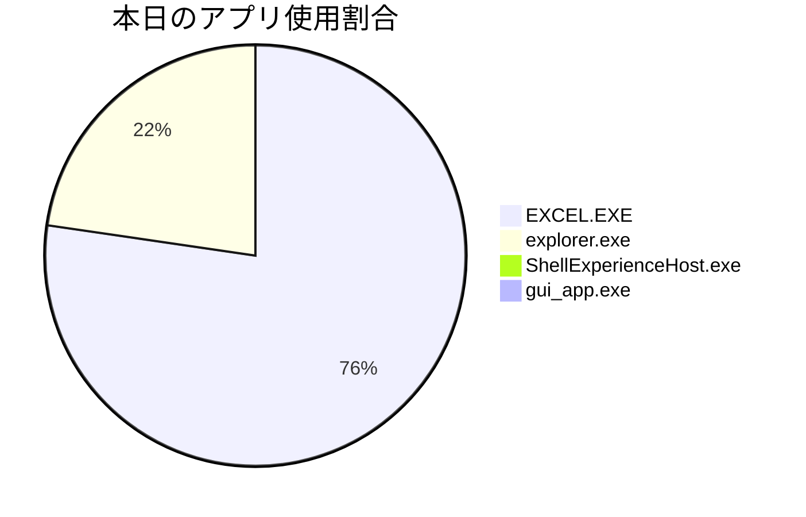

優秀なエグゼクティブ向けコンサルタントとして、ご提供いただいたAI画像解析ログに基づき、貴社の業務効率化に向けた分析と改善提案を実施しました。

## 📊 本日の作業フローと時間対効果（手作業 vs 自動化）

本日ログされた約17分間の作業は、主に「商品課の週次報告書作成」と「受注明細データの集計・分析」に費やされていました。特にファイル探索、複数ファイルからの手動コピペ転記、およびExcelでのデータ加工に多くの時間がかかっていることが確認できました。これらの反復的な手作業を自動化することで、大幅な時間短縮が見込まれます。

| 作業フェーズ                          | 手作業での所要時間（推測） | プログラム（RPA/Python）で自動化した場合の参考時間 | 時間短縮効果（削減時間） |
| :------------------------------------ | :------------------------- | :------------------------------------------------- | :----------------------- |
| **1. データ収集・ファイル特定**       | 約 2分 8秒                 | 約 5秒                                             | **約 2分 3秒**           |
| _複数の共有ドライブやローカルフォルダから週次報告書や受注明細、商品関連ファイルを検索し、開く作業。_ | | | |
| **2. 週次報告書へのデータコピペ・転記** | 約 3分 29秒                | 約 10秒                                            | **約 3分 19秒**          |
| _複数のExcelファイルやシートから必要なデータを抽出し、週次報告書や商品政策書の該当箇所へ手動でコピー＆ペースト、入力する作業。特定の列範囲のコピペも含まれる。_ | | | |
| **3. 受注明細データ処理・集計**       | 約 8分 41秒                | 約 30秒                                            | **約 8分 11秒**          |
| _受注明細CSVデータの確認、期間フィルター設定、販売明細の閲覧、ピボットテーブル作成検討、手動での分類・集計作業。_ | | | |
| **4. 実績データ分析の下準備**         | 約 1分 31秒                | 約 1分 0秒                                         | **約 31秒**              |
| _商品分類別売上・粗利の計画実績分析、好不調要因まとめ。報告書更新の一部。完全に自動化は困難な分析作業だが、データ整理までを自動化。_ | | | |
| **合計**                              | **約 15分 49秒**           | **約 1分 45秒**                                    | **約 14分 4秒**          |

**月次・年次効果の試算**:
この週次業務が毎週発生すると仮定した場合、年間で `14分4秒 × 52週 ＝ 約 12時間` の業務時間を削減できます。これにより、担当者はより戦略的な分析や企画業務に時間を投入できるようになります。

---

## ⏱ アプリ別の使用時間


```text
【アプリ別 稼働時間ランキング】
EXCEL.EXE       | ██████████████████████         |  76.4% (13分17秒)
explorer.exe    | ██████                         |  22.4% (3分54秒)
ShellExperience |                                |   1.0% (10秒)
gui_app.exe     |                                |   0.2% (2秒)
```

---

## 💡 手作業の分析と自動化に向けたアクション

### 🤖 自動化への具体的なステップ（DX化案）

ログから、以下3つの主要なボトルネックが特定されました。
1.  **複雑なファイル探索と管理**: 週次報告書や関連資料が複数のフォルダに散在し、手動で検索・特定している。
2.  **手動によるデータ転記**: 複数のExcelやCSVから週次報告書への手動コピペが頻繁に発生している。
3.  **Excelでの反復的なデータ加工**: 受注明細データのフィルター、集計、ピボットテーブル作成検討など、定型的な操作が多い。

これらのボトルネックに対し、以下のステップで自動化を進めます。

**Step 1: データソースとフォーマットの標準化**
*   **内容**: 週次報告書作成に必要な全てのデータ（受注明細、商品管理、計画実績など）のファイルパス、命名規則、内部フォーマット（シート名、列名、データ型）を明確に定義し、標準化を徹底します。特にCSVファイルやExcelシートの列配置、データ型にばらつきがないか確認し、統一します。
*   **目的**: ロボットが確実にデータを見つけ、処理できるようにするため。

**Step 2: データ収集スクリプト（RPA）の実装**
*   **内容**: RPAロボットを作成し、Step1で標準化されたルールに基づき、指定された共有ドライブやローカルフォルダから必要なExcelファイルやCSVファイルを自動で検索・取得します。ファイル名や日付情報に基づいて最新のファイルを特定するロジックを組み込みます。
*   **目的**: ファイル探索・取得にかかる手作業時間をゼロにする。

**Step 3: データ統合・加工処理（Pythonスクリプト）の実装**
*   **内容**: 取得した複数のデータソース（受注明細CSV、商品管理Excelなど）をPython（pandasライブラリ活用）で読み込み、必要なデータを抽出、統合します。期間フィルター、不要列の削除、欠損値処理、データ型変換、商品コードなどをキーとした関連データの結合など、週次報告書や分析に必要な形にデータを整形・加工します。
*   **目的**: 手動でのデータ整理、コピペ、フィルタリング、VLOOKUPなどの反復作業を自動化し、データ品質を均一化する。

**Step 4: 自動集計・レポート転記（RPA/Python）の実装**
*   **内容**: 整形済みのデータから、週次報告書や商品政策書に記載する売上、粗利、実績、計画進捗率などの各種指標を自動で集計します。これらの集計結果を、週次報告書のExcelテンプレートの所定のセルにRPAで自動転記します。
*   **目的**: 手動でのコピペ転記作業をなくし、入力ミスを防止する。

**Step 5: レポート出力・保存とレビュープロセス**
*   **内容**: 更新された週次報告書Excelファイルを、指定された命名規則とフォルダ構造に従って自動で保存します。担当者は最終生成された報告書を確認し、「好不調要因」や「今後の施策」に関するコメントは手動で追記するフローとします。
*   **目的**: 報告書作成プロセスの効率化と、担当者が高付加価値業務に集中できる環境を整備する。

---

### ❓ 担当者へのヒアリング事項

自動化プロジェクトを円滑に進めるため、以下の点について業務担当者の方にご確認をお願いいたします。

*   **データソースの現状と整合性**:
    *   週次報告書や商品政策書作成時に参照するExcelファイルやCSVファイルは、常に同じフォルダパス、ファイル名パターンで保存されていますか？また、そのファイルはどのように更新されていますか？
    *   参照しているExcelファイルのシート名や列名は固定ですか？それとも業務によって変更されることがありますか？
    *   「多数のExcelで週次販売・商品管理データを参照・更新中」とありますが、具体的にどのファイル群を指し、それらの関連性（キーとなる項目など）は何ですか？
*   **報告書のフォーマットと内容**:
    *   週次報告書や商品政策書のExcelテンプレートは固定ですか？レイアウト変更の頻度はどれくらいですか？
    *   「好不調コメント」や「今後の取り組み内容」といった定性的な情報は、どのような基準で作成されていますか？これらの記述をサポートするために、どのようなデータや分析結果が自動化で提供されると最も役立ちますか？
*   **コピペ・転記のロジック**:
    *   「CH列からCV列のデータをコピー＆ペースト」や「他シートから大分類実績データをコピペ入力」などとありますが、コピー元とコピー先の具体的なマッピングルールはありますか？（例: ファイルAのシートXのA列を、ファイルBのシートYのC列に転記する、など）
*   **データ集計・分析の要件**:
    *   受注明細の分類や集計作業は、最終的にどのような分析結果を得ることを目的としていますか？（例: 商品別、顧客別、期間別の売上・粗利合計など）
    *   ピボットテーブルを作成しようとしている場面がいくつか見受けられましたが、具体的にどのような行・列・値のフィールドを組み合わせて集計したいですか？
*   **例外処理と手作業の必要性**:
    *   データに異常値が見つかった場合や、特定の条件に合致しないデータがあった場合の対応フローはありますか？
    *   現状、自動化が難しいと感じている手作業はありますか？それはどのような理由からですか？

---

## 🔄 現在の処理フローチャート

Mermaid.jsを用いて、現在の業務フローと自動化の案をコンパクトに可視化しました。RPAロボットが代替する部分を明確に示しています。

```mermaid
graph TD
    A["業務開始: 週次報告書作成"] --> B["データ探索・収集(手作業)"]
    B --> C["複数データ参照・手動コピペ転記"]
    C --> D["受注明細データ処理・集計(手作業)"]
    D --> E["週次報告書への実績入力(手作業)"]
    E --> F["実績データ分析・コメント記述(人間)"]
    F --> G["週次報告書完成・保存"]
    G --> H["業務終了"]

    subgraph 自動化フロー (RPAロボット)
        R1["RPA: 必要データ自動探索・収集"]
        R2["RPA: 複数データソース統合・整形"]
        R3["RPA: 各種指標自動集計"]
        R4["RPA: 週次報告書テンプレートへ自動転記"]
    end

    B -- 自動化対象 --> R1
    C -- 自動化対象 --> R2
    D -- 自動化対象 --> R3
    E -- 自動化対象 --> R4
    R1 --> R2
    R2 --> R3
    R3 --> R4
    R4 --> F
```