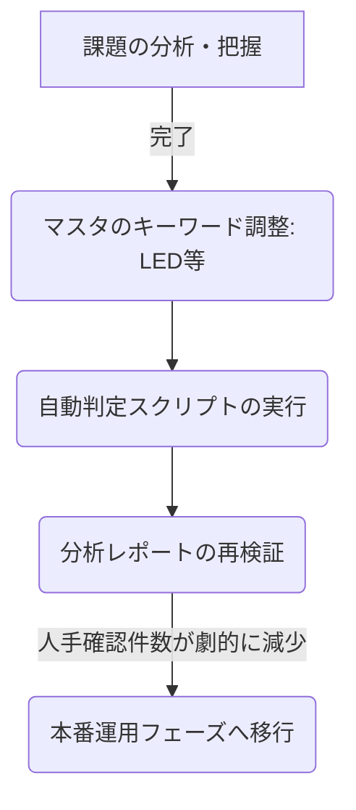

# 📋 PSE自動判定プロジェクト 課題・タスク管理一覧

> **【対象チャット】**: Automating Product Master CSV Processing

本ドキュメントは、商品マスタ（20万件超）に対する電気用品安全法（PSE）の自動判定プロジェクトにおける、これまでの背景、解決済みの課題、および現在直面している最新の課題と今後のタスクをまとめた一覧です。

---

## 🎯 プロジェクトの目的
ECサイトで取り扱う膨大な商品マスタから、電気用品安全法（PSE）の対象商品を自動的かつ高精度に判別し、仕分け業務の劇的な効率化とコンプライアンス遵守の両立を目指します。

---

## 🛠️ 1. これまでに解決した課題と実装済みの対策

これまで開発初心者である社内SE様との二人三脚で、以下の課題をクリアし、プログラムの高度化を行ってきました。

| # | 課題（発生していた問題） | 実装した対策（解決アプローチ） | 状態 |
| :--- | :--- | :--- | :--- |
| **1** | **処理速度とPCのフリーズ懸念** 20万件超（約234MB）の巨大データを一度に処理すると、PCがフリーズしたり進捗が分からなくなる。 | Pandasを用いたメモリ最適化処理に加え、1,000件ごとに**進捗率（%）、経過時間、予測残り時間**をターミナルにリアルタイム表示する機能を実装。約4分で完走する軽量化に成功。 | **解決済** |
| **2** | **Excelでのファイルオープンエラー** 出力先CSVをExcelで開いたままスクリプトを実行すると、書き込みアクセス制限（PermissionError）で処理全体が異常終了してしまう。 | 保存処理を `try-except` で保護し、エラー発生時は自動的に**タイムスタンプを付加した別名で安全に保存**するエラーハンドリングを導入。 | **解決済** |
| **3** | **医療機器・産業用などのグレーゾーン混入** 「AC100V駆動だが、医療機器や工場用など一般消費者向け（PSE対象）ではないもの」が誤検出される。 | AO列（備考や用途区分など）の情報を最優先で走査し、**「医療機器」「産業用」「工業用」「車載用」**などの除外キーワードがあれば即座に弾く「超優先除外」ロジックを実装。 | **解決済** |
| **4** | **付属品・オプション品（関連品）の誤検出** 本体ではない「リモコン」や「接続コード」などのオプションパーツが、商品名に含まれるキーワードでPSE対象と誤判定されてしまう。 | AK列（関連品フラグなど）の内容をチェックし、**「関連品」の文字が含まれる場合は本体ではないとみなして即座に「PSE対象外」**にするロジックを新規追加。 | **解決済** |
| **5** | **「PSE対応」「PSE対象外」などの明記の優先化** データ内に「PSE認証取得済み」や「PSE対象外」とすでに明記されているのに、品目マスタとの照合で判定がぶれてしまう。 | AM/AN/AO列のいずれかに**「PSE対応」「マーク取得済」等の明記があれば強制的に「PSE対象」**とし、逆に**「対象外」「認証不要」があれば強制的に「対象外」**とするショートカット判定を導入。 | **解決済** |
| **6** | **表記揺れ（半角・全角）によるすり抜け** 「ＰＳＥ（全角）」と「PSE（半角）」、「１００Ｖ」と「100V」などの表記のぶれによって、キーワードマッチングをすり抜けてしまう。 | Pythonの標準ライブラリ `unicodedata.normalize('NFKC', ...)` をテキスト抽出の全工程に導入し、**全角文字・半角カタカナをすべて標準的な半角英数・全角カタカナに自動変換（正規化）してから照合**する仕組みを確立。 | **解決済** |
| **7** | **モバイルバッテリーのDC駆動による誤除外** モバイルバッテリーやリチウムイオン蓄電池は本質的に直流（DC）動作のため、従来の「DC駆動＝対象外」ルールによって誤除外されていた。 | 品目名に「リチウムイオン蓄電池」または「モバイルバッテリー」が含まれる場合は、**DC駆動であっても除外せずに「PSE対象」として残す例外ロジック**を実装。 | **解決済** |
| **8** | **「PSマークの種類：PSE」などの明記のすり抜け** 「ＰＳマークの種類：ＰＳＥ 」や「PSE技術基準適合」など、改行コードや他の文字が言葉の間に挟まると、キーワード完全一致チェックをすり抜けていた。 | 文章内に「PSマーク」と「PSE」の両方、または「PSE」と「適合」の両方が含まれている場合、**表記形式を問わず即座に「PSE対象」に引き上げる頑健なロジック**を実装。 | **解決済** |
| **9** | **低電圧・通信用ケーブル（USBケーブル等）の誤検出** USBケーブル等の商品説明にある「コンセントから充電」や「充電器ポートから」という言葉が、マスタの「コンセント」等に誤ってヒットし「PSE対象」になっていた。 | 品名や説明文に「usbケーブル」「スマホケーブル」などの通信ケーブルキーワードが含まれ、かつ本物のAC電源用コードでない場合は、**「低電圧・通信用ケーブルのため除外」とする自動クリーニング処理**を実装。 | **解決済** |

---

## ⚠️ 2. 現在直面している最新の課題と対策（次の一手）

今回の20万件データの分析によって新たに浮き彫りになった、**精度をさらに極めるための最重要課題**です。

### 🚨 課題⑦：「LED」などの英語表記と、国（経産省）のマスタの「エル・イー・ディー」の不一致
* **発生している事象**:
  AC100Vで動くLED照明器具（例: `ﾌﾞﾗｲﾄLED` や `LED ﾊﾞｰﾗｲﾄ` など）が、品目マスタをすり抜けて「品目未ヒットのため要確認」として1,875件ほど検出されています。
* **原因**:
  経産省の公表している法律上の品目名が **「エル・イー・ディー・ランプ」** や **「エル・イー・ディー・灯具」** のように「カタカナ」で登録されているため、商品名に `LED`（英語）や `LEDライト` と書かれている商品とマッチしていません。
* **対策（案）**:
  `PSE判定用ルールマスタ.csv` の表記揺れキーワード（`extra_keywords`）列に、英語表記の **`led`** や、カタカナの **`バーライト`** などを追加してマスタ自体をアップデートします。これで、すり抜けていたLED商品が一網打尽で「PSE対象」に自動分類されます。

### 🚨 課題⑧：人手確認（グレーゾーン）対象件数のさらなる削減
* **発生している事象**:
  「人手による確認が必要（要人手確認=1）」と判定された件数が、全体の約13.9%（28,715件）あります。
* **原因**:
  万が一の事故を防ぐため、高リスク品目（扇風機、ストーブ、モバイルバッテリーなど）や、特定電気用品（ACアダプタなどの直流電源装置など）、および「DC駆動でPSE対象外になった品目一致品」をすべて安全側に倒して「人手確認フラグ=1」に設定しているためです。
* **対策（案）**:
  「直流電源装置（ACアダプタ）」などでDC駆動により対象外となったものは安全性が明白なため、除外理由が確定している場合は人手確認フラグを `0` に落とすなど、条件のチューニングを行って「本当に人手で見るべき商品」だけに絞り込みます。

---

## 📋 3. 今後のロードマップとToDo

1. **[ToDo]** `PSE判定用ルールマスタ.csv` の更新（LED関連の表記揺れに `led` を追加）
2. **[ToDo]** `csv_pse_processor.py` の再実行による精度検証
3. **[ToDo]** 人手確認フラグ（グレーゾーン）の自動クリア条件の検討（DC駆動除外品の人手確認フラグオフ）
4. **[ToDo]** 最終確定版ツールとしてのデプロイ（チームへの共有）
