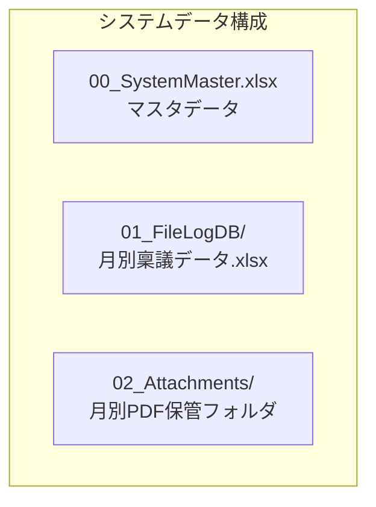

# 現行ワークフローシステム (ForestWorkFlowSystem) 現状分析レポート

ご提示いただいた `gs.txt`、`html.txt`、および `ForestWorkFlowSystem` フォルダ内の構成（Excelマスタ、月別データベース等）から、現行システムの動作構造と課題を詳細に分析しました。

---

## 🔍 1. 現行システムのフォルダ・データ構造

### ① 管理データ構成 (Excelファイル)
* **`00_SystemMaster.xlsx` (システムマスタ)**
  * `m_user`: 社員の名前、部署、メールアドレス、システム利用権限などを定義。
  * `m_route_form`: 申請種類（フォーム）ごとに、初期承認ルート（JSON形式の承認ステップ定義）や添付ファイルの保存先フォルダをマッピング。
  * `m_route_template`: 標準的な承認ルートの雛形テンプレート。
* **`01_FileLogDB/` (月別データベース)**
  * 月ごとに「`YYYYMM_稟議データ.xlsx`」が自動生成される仕組み。
  * 各ファイル内に以下の2つのトランザクションシートを保持：
    * `t_application`: 各申請の基本情報（申請番号、フォーム名、標題、申請者、日時、PDFパス、進行ステップ、全体ステータス）。
    * `t_route`: 各申請に紐づく「承認ルートと各ステップの進捗状況（誰が、いつ、承認/決裁/確認/差し戻しをしたか、そのコメント）」。
* **`02_Attachments/` (添付PDFファイル)**
  * 申請時にアップロードされた稟議書（PDF）が、月別のサブフォルダ（例: `202607/`）に仕分けされて保存される。

---

## 🛠 2. プロセス（承認ロジック）の動作解析

現行の GAS コード (`gs.txt`) から、申請から決裁までのライフサイクルは以下のロジックで制御されています。

1. **申請登録 (`addNewApplication`)**
   * 今月のデータベースシート `t_application` にレコードを追加し、申請番号（例: `2026071001`）を発行。
   * フォーム定義に基づいて個別の承認ステップを `t_route` シートに展開し、ステップ1の承認者に自動通知メールを送信。
2. **ステップ進行・承認処理 (`processApprove`)**
   * 現在の承認者が「承認」「確認」「決裁」アクションを行うと、該当ステップのステータスを更新し、実行日時とコメントを記録。
   * **順次承認（全員）**: 次のステップに進める。
   * **承認（誰か1人）**: 該当ステップに複数割り当てられている場合、他の処理者に「承認（他者済）」をセットして次のステップに進める。
   * 最終ステップ（決裁）が完了すると、全体のステータスを「決裁」とし、申請者へ完了通知メールを送信。
3. **差し戻し・却下・引き戻し**
   * **差し戻し (`processReturn`)**: 進捗をステップ1（申請者）に戻し、ステータスを「差し戻し」にする。修正後に再申請が可能。
   * **引き戻し (`processWithdraw`)**: 申請者本人がまだ承認されていない稟議を取り下げる処理。
   * **却下 (`processReject`)**: 承認者がその時点で稟議を終了させる処理。

---

## ⚠️ 3. 現行システムの致命的な課題（同時書き込みエラー）

今回のアクセス頻度計算で浮き彫りになった「同時アクセス時のロック競合（エラーでシステムが確実に止まるリスク）」の根本原因は以下の仕様にあります。

* **課題1: Excel/スプレッドシートへの直接書き込みの物理的限界**
  * GASのコードでは `LockService.getScriptLock()` を使用し、書き込みの衝突を防ぐために30秒間の「順番待ち（ロック制御）」をかけています。
  * しかし、同一の「分」に複数人が同時に承認・確認などの書き込みボタンを押すと、30秒のタイムアウトを超えた処理が **「アクセスが集中しています。再度実行してください。」** というエラーで強制終了してしまいます。
* **課題2: データが「月別ファイル」に分断されている**
  * 「202606_稟議データ」「202607_稟議データ」のようにファイルが月ごとに完全に分離しているため、過去数ヶ月にわたる申請データを横断検索したり、年間集計を出したり、監査ログを追うのが非常に困難です。

---

## 💎 4. Python + Firebase 構成への移植による劇的な改善効果

1. **ロックエラーの完全解消**
   * Firestore (NoSQLデータベース) は、秒間数万件の超高速な同時書き込みに対応。GASで必要だった `LockService` や、ユーザーにストレスを与える「順番待ち画面」自体が**完全に不要**になります。
2. **月別ファイル分割の廃止（データの一元化）**
   * データを月ごとに分ける必要がなくなります。すべての申請データを単一のデータベーステーブル（コレクション）に保存し、インデックスによって数万件の中から「指定した申請」「特定の申請者」「過去1年分のデータ」を0.1秒以下で一発検索・集計できるようになります。
3. **ローカル環境/Webサーバーでの安定稼働**
   * Python (FastAPI/Flask) による動作により、Google APIの呼び出し遅延やタイムアウト（GASの実行制限など）に縛られない高速なレスポンスが実現します。
