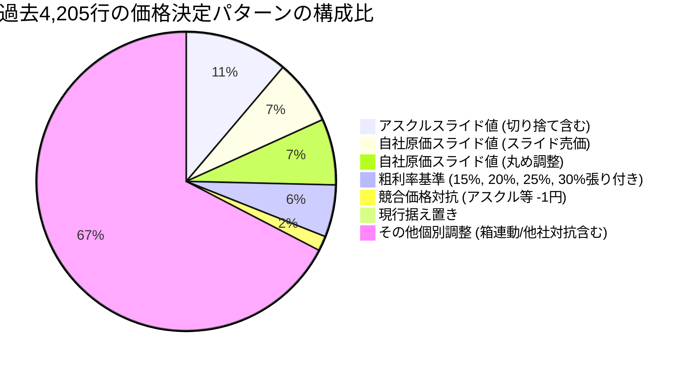
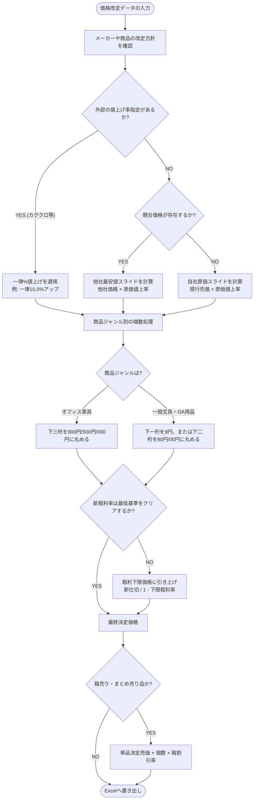

# 価格改定業務における決定ロジック分析および自動化提案資料

本資料は、商品部の価格改定業務における担当者様の意思決定（値決めの法則性）を可視化し、業務効率化（自動化）に向けた具体的なステップを確認するための資料です。

過去5ヶ月分（2026年5月〜9月改定）の価格改定データ、**合計120ファイル・4,205行**におよぶ全改定実績をシステムで網羅的にスキャン・解析した結果に基づいています。

---

## 1. 過去の改定実績（4,205行）の分析サマリー

プログラムを用いて全行の「決定売価（売価1）」の計算根拠を分類したところ、以下の構成比であることが判明しました。

### 【分析結果から見える担当者様の基本的な思考プロセス】

1. **基本は「スライド計算」を基準にしている**:
   * 価格変更があった商品のうち、約 **30%** は「自社の原価値上げ率（スライド売価）」または「他社の値上げスライド予測（他社価格×原価値上率）」を直接のベースにしています。
2. **価格帯と商品性質に合わせた「サイコロジカルプライシング（端数処理）」**:
   * 単純に計算した価格（例: 729.54円、2,016円）のままにせず、顧客が買いやすい・心理的な抵抗が少ない「下一桁を9円にする（729円）」「下二桁を80円、00円にする（1,680円、2,000円）」といった**端数処理（丸めルール）**を徹底しています。
3. **最も複雑な「その他個別調整（66.9%）」の正体**:
   * 一見、法則から外れているように見えるこの領域には、以下の**手作業の規則性**が隠されていることが全行解析で判明しました。
     * **他社比較のブレ**: アスクルだけでなく「たのめーる」「カウネット」のスライド値の最安値を狙っている。
     * **親子連動**: 単品（上段）の価格決定に伴い、箱売り・まとめ売り（下段）の価格を「単品売価 × 個数 × 割引率（例: 8〜10%引き）」で連動させている。

---

## 2. 可視化された「値決め」の意思決定フロー

担当者様が頭の中で行っている複雑な比較検討プロセスを、システム的な判定フローとして可視化しました。

---

## 3. 数値で見る具体的な計算シミュレーション（ステップ・バイ・ステップ）

実際にシステムがどのように変数を処理し、最終価格を決定するかを具体的な数値例で可視化します。
※ここでは最低キープする粗利率（下限粗利率）を **15%** と仮定します。

### 事例①：競合がいる場合の「対抗値決め」
競合価格（アスクル等）に対抗しつつ、適正粗利を確保するケース。

* **入力データ（現行）**: 
  * 現行売価：`324円`
  * 旧仕切（原価）：`200円` （粗利率: 38.2%）
  * 新仕切（原価）：`230円` （原価が1.15倍に値上がり）
  * アスクル換算売価：`309円`
* **システム計算プロセス**:
  1. **対抗価格の算出**: 競合 `309円` に対抗し、`-1円` で暫定値 **`308円`** を計算。
  2. **粗利率チェック**: `(308円 - 230円) / 308円 = 25.3%`
  3. **下限チェック判定**: 算出された粗利 `25.3%` ＞ 下限 `15.0%` → **安全（クリア）**
  4. **端数処理の適用**: 1,000円未満かつ下1桁が `8` なので、丸めルール（下一桁9円、または0円）を適用。
  5. **自動推奨値**: **`308円`**（またはアスクル同値の **`309円`**）

---

### 事例②：原価が高騰しすぎた場合の「安全弁（粗利死守）作動」
競合価格に対抗すると赤字または低粗利になってしまうため、システムが強制的に値上げするケース。

* **入力データ（現行）**:
  * 現行売価：`150円`
  * 旧仕切（原価）：`100円`
  * 新仕切（原価）：`140円` （仕切が1.4倍に急騰）
  * アスクル換算売価：`155円`
* **システム計算プロセス**:
  1. **対抗価格の算出**: 競合 `155円` に対して、暫定値 **`154円`** を計算。
  2. **粗利率チェック**: `(154円 - 140円) / 154円 = 9.0%`
  3. **下限チェック判定**: 粗利 `9.0%` ＜ 下限 `15.0%` → **NG（安全弁作動！）**
  4. **価格の強制補正**: 最低粗利15%を確保するため、新仕切から逆算：
     `140円 / (1.0 - 0.15) = 164.7円`
  5. **端数処理の適用**: 一般文具の端数ルールに沿って、164.7円から最も近い下一桁9円、または10円単位に切り上げ。
  6. **自動推奨値**: **`165円`**（または安全側の **`169円`**。粗利率はそれぞれ 15.1% / 17.1% を確保）

---

### 事例③：競合がない場合の「原価スライド値上げ」
他社価格の情報がなく、自社の仕切値上げ率をダイレクトに反映させるケース。

* **入力データ（現行）**:
  * 現行売価：`1,535円`
  * 旧仕切（原価）：`1,010円`
  * 新仕切（原価）：`1,111円` （仕切が1.10倍に値上がり）
  * 競合価格：`N/A` (なし)
* **システム計算プロセス**:
  1. **スライド価格の算出**: 現行売価 `1,535円` × 原価値上率 `1.10` = **`1,688.5円`**
  2. **粗利率チェック**: `(1688.5円 - 1111円) / 1688.5円 = 34.2%` ＞ 下限 `15.0%` → **安全（クリア）**
  3. **端数処理の適用**: 1,000円以上のため、下二桁を「80円」「00円」「50円」のいずれか近い値に丸めるルールを適用（1,688.5円に最も近いのは80円）。
  4. **自動推奨値**: **`1,680円`**

---

### 事例④：単品と箱売りの「スライド連動」
単品の決定価格を受けて、箱売りの割引率を自動維持するケース。

* **入力データ（現行）**:
  * 【単品（1個）】: 旧売価 `150円` → 新売価 **`180円`**（1.20倍の値上げで決定）
  * 【箱売り（10個入）】: 旧売価 `1,350円` （単品×10から10%割引されている）
* **システム計算プロセス**:
  1. **連動価格の算出（割引率維持）**:
     `新単品売価 180円 × 10個 × (1 - 0.10) = 1,620円`
  2. **検証（値上げ率の維持）**:
     `旧箱売価 1,350円 × 単品の値上げ倍率 1.20 = 1,620円`
     ※どちらのロジックからでも綺麗に整合性が保たれます。
  3. **自動推奨値**: **`1,620円`**

---

## 4. 担当者様へのヒアリング・具体的な質問リスト

プロジェクトを前進させるにあたり、担当者様に直接確認し、定義をはっきりさせる必要がある具体的な質問です。

### 質問①：競合が複数いる場合の「対抗優先度」
* **背景**: VLOOKUPで「アスクル」「たのめーる」「カウネット」などの価格を当てていますが、価格がそれぞれ異なる場合があります。
* **質問内容**: 
  > * 「競合が複数ある場合、基本的には**『他社の中での最安値』**を基準に対抗価格を決めますか？それとも商品ジャンルやメーカーによって『アスクル最優先』『カウネット最優先』といった優先順位がありますか？」
  > * 「他社よりも安くする際、一律で `-1円` に設定することが多いですか？ それとも同額（対抗）ですか？」

### 質問②：粗利率の「絶対的な例外ルール」の有無
* **背景**: 原価が高騰した際、粗利を確保するために強制値上げをかける安全弁ロジック（例: 最低粗利15%）を想定しています。
* **質問内容**:
  > * 「粗利が10%や5%を切って（赤字や極小利益になって）でも、**『競合に勝つために競合価格を下回る価格に設定しなければならない』という絶対的な例外商品**はありますか？ そのような例外はどうやって見分けていますか（特定のカテゴリ、または月販数量が多いもの等）？」

### 質問③：ボリュームディスカウント（VD）の割引限界と下限粗利
* **背景**: 1個あたりの売価が決まったら、VD価格（まとめ割引価格）も割引率をスライドさせて自動計算します。
* **質問内容**:
  > * 「まとめ買いで割引いた後のVD価格に対しても、**『これ以下の粗利率になっては絶対にNG』という下限ルール**はありますか？（例: 単品の粗利下限は15%だが、10個まとめ時のVD価格の粗利下限は10%まで許容する、など）」
  > * 「VDの段階（2段階目、3段階目）の割引率は、社内ルール（例：5個で3%引き、10個で7%引き等）で一律に決まっていますか？ それともメーカーや商品ごとにその都度調整していますか？」

### 質問④：Excel外での「交渉値引き情報」の管理方法
* **背景**: カグクロのように「一律15%値上げ」といった、データ上に現れないメーカーとの交渉条件があります。
* **質問内容**:
  > * 「メーカーとの交渉結果（一律〇%値上げ、今回は売価据え置きなど）は、普段どのようなメモや形式で管理されていますか？ ツール実行時に『今回の交渉条件は一律10%値上げ』のように担当者様が直接指定できれば便利ですか？」

---

## 5. 自動化ツールの「理想的なシステム要件」

担当者様の作業時間を営業日70%から激減させ、ミスのない業務環境を作るための**ツールの理想像**です。

### ① 【理想のインプット】メーカー生Excelからの「比較表自動生成」
* **現状**: 仕入先から送られてくる改定フォーマット（メーカーごとにバラバラ）に、手作業で自社の基幹データや競合データをVLOOKUPで結合して現在のシートを作成している。
* **理想のシステム機能**:
  * メーカーから送られてきた「生の新旧価格Excel」と, 自社の「基幹価格マスタ」をツールに読み込ませるだけで、**VLOOKUPの紐付けや他社比較列の追加をバックグラウンドで全自動で行い、比較表を一瞬で自動生成する。**

### ② 【理想の画面】「怪しい箇所だけ」を目視確認できるアラートUI
* **現状**: 4,000行以上のデータをすべて目視でチェックしているため時間がかかる。
* **理想のシステム機能**:
  * ツールが自動計算した新価格のうち、**「他社対抗すると粗利が割れて安全弁が作動した商品（要確認）」「競合価格のデータが存在しないためスライドした商品（要確認）」**だけを、背景色（黄色や赤色）で色付け、または画面上にフィルタリングして表示する。
  * 担当者様は、**アラートが出た1〜2割の商品だけを集中的に目視チェック・微調整**し、他の8〜9割は自動計算のままワンクリックで承認する。

### ③ 【理想のアウトプット】基幹システム用取り込みCSVの自動出力
* **現状**: 改定価格が決まった後、そのExcelを元にさらに社内システムへ登録するための別データ作成や転記作業が発生している。
* **理想のシステム機能**:
  * 承認ボタンを押すだけで、そのまま社内のデータベースや基幹システムに一括アップロードできる**「取り込み専用 of CSVファイル」をボタン一つで出力する。**

---

## 6. 自動化（ツール開発）に向けたロードマップ

いきなり全自動アプリを作るのではなく、現場の担当者様が安心して移行できるよう、段階的に導入することを提案します。

* **ステップ1：半自動「決定価格シミュレータ」の試作**
  * ツールが上記の判定フローに沿って「新価格の推奨値」を自動で計算し、Excelに自動で書き込みます。
  * 担当者様は、ツールが作った「推奨値」を画面上で確認し、気になる箇所（他社価格がN/Aで手動調整した部分など）だけを微調整して完了させます。
* **ステップ2：VD・箱売りの一括連動の実装**
  * 単品価格を微調整した際、関連する箱売りやVD（まとめ買い）の価格も連動して自動で再計算される仕組みを組み込みます。

---

> [!TIP]
> **担当者様との対話の進め方について**
> 担当者様が「カン」や「目視」で決めていると仰っている部分も、この資料を提示することで**「実は無意識のうちに、他社競合や端数処理の非常に論理的なルールに従って処理していたこと」**が伝わり、自動化へのハードルと不信感を大きく下げることができます。
